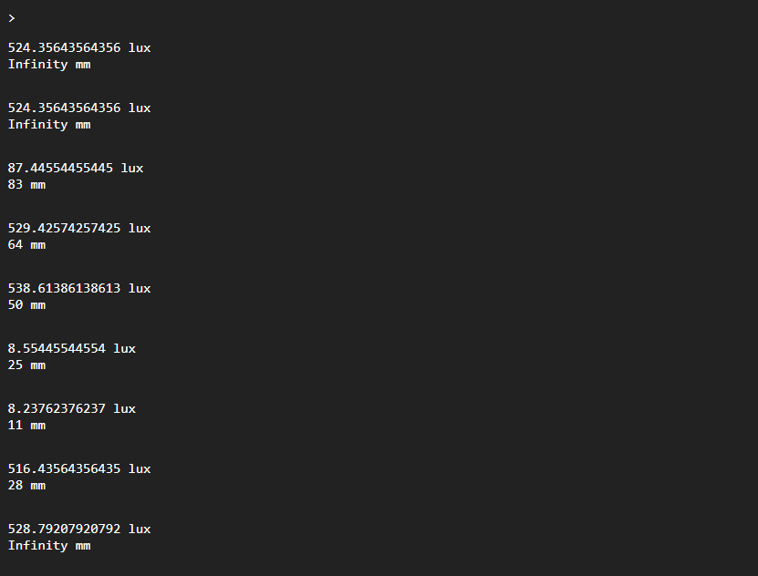

# ModuleVL6180
////

# Лицензия
////

# Описание
<div style = "font-family: 'Open Sans', sans-serif; font-size: 16px; color: #555">

Модуль реализует базовые функции датчика освещенности и расстояния. Модуль работает по протоколу I2C, разработан в соответсвии с нотацией архитектуры фреймворка EcoLite и является потомком класса [ClassMiddleSensor](https://github.com/Konkery/ModuleSensorArchitecture/blob/main/README.md). Количество каналов для снятия данных - 2. 
Датчик VL6180 применяется в сценариях, где важно определение близкого приближения объектов, а не абсолютное измерение расстояния с высокой точностью. 
При использовании только одного канала, датчик работает с периодичностью в 120 мс. При опросе двух каналов, датчик чередует замеры освещенности и расстояния, таким образом, периодичность опроса одного канала составляет уже 240 мс. 

### **Конструктор**
Конструктор принимает 1 объект типа **SensorOptsType** и 1 объект типа **SensorPropsType**.
Пример *_opts* типа [**SensorOptsType**](https://github.com/Konkery/ModuleSensorArchitecture/blob/main/README.md):
```js
const _opts = {
    bus: i2c_bus,
    address: 0x29,
}
```
- <mark style="background-color: lightblue">bus</mark> - объект класса I2C, возвращаемый диспетчером I2C шин - [I2Cbus](https://github.com/Konkery/ModuleBaseI2CBus/blob/main/README.md);
- <mark style="background-color: lightblue">address</mark> - адрес датчика на шине;

### **Поля**
- <mark style="background-color: lightblue">_MinPeriod</mark> - минимальная частота опроса датчика - 120 мс;
- <mark style="background-color: lightblue">_UsedCh</mark> - используемые каналы данных по нотации архитектуры фреймворка EcoLite;
- <mark style="background-color: lightblue">_Interval</mark> - функция SetInterval для опроса датчика.

### **Методы**
- <mark style="background-color: lightblue">Init(_sensor_props)</mark> - метод обязывающий провести инициализацию датчика настройкой необходимых для его работы полей и регистров;
- <mark style="background-color: lightblue">ConfigureRegs()</mark> - метод конфигурирует регистры, влияющие на параметры работы датчика;
- <mark style="background-color: lightblue">Start(_num_channel)</mark> - метод запускает циклический опрос определенного канала датчика со стандартной периодичностью;
- <mark style="background-color: lightblue">Stop(_num_channel)</mark> - метод прекращает считывание значений с заданного канала;
- <mark style="background-color: lightblue">PerformSingle(_num_channel)</mark> - метод запускает единичный замер с указанного канала;
- <mark style="background-color: lightblue">UpdateValues()</mark> - метод считывает показания датчиков с регистров и приводит их к люксам и мм.
- <mark style="background-color: lightblue">SetAddress(addr)</mark> - аппаратно устанавливает адресс датчика на шине и поле Address.

### **Возвращаемые данные**
Датчик предоставляет данные об освещённости окружения в люксах (lux) и расстояние до препятсвия в мм. 

### **Примеры**
Пример программы для вывода данных раз в одну секунду:
```js
//Подключение необходимых модулей
const ClassI2CBus = require("ModuleI2CBus");
const err = require("ModuleAppError");
const NumIs = require("ModuleAppMath");
     NumIs.is();
const VL6180 = require("ModuleVL6180");

//Создание I2C шины
let I2Cbus = new ClassI2CBus();
let _bus = I2Cbus.AddBus({sda: P5, scl: P4, bitrate: 100000}).IDbus;

//Настройка передаваемых объектов
let opts = { bus: _bus, pins: [P5, P4], address: 0x29 };
let sensor_props = {
    quantityChannel: 2,
    name: "VL6180",
    type: "sensor",
    channelNames: ['light', 'range'],
    typeInSignal: "analog",
    typeOutSignal: "digital",
    busType: ["i2c"],
    manufacturingData: {
        IDManufacturing: [                  
            { "Adafruit": "4328435534" }    
        ],
        IDsupplier: [                     
            { "Adafruit": "4328435534" }    
        ],
        HelpSens: "VL6180 ambience and range sensor"
    }
};
//Создание объекта класса
let vl6180 = new VL6180(opts, sensor_props);

//Создание каналов и их использование
const ch0 = vl6180.GetChannel(0);
const ch1 = vl6180.GetChannel(1);
ch0.Start();
ch1.Start();

setInterval(() => {
  console.log(ch0.Value + "lux");
  console.log(ch1.Value + "mm");
}, 1000);
```
Результат выполнения:
<div align='center'>
    
</div>
### Зависимости

- <mark style="background-color: lightblue">[**ModuleSensorArchitecture**](https://github.com/Konkery/ModuleSensorArchitecture/blob/main/README.md)</mark> под именем *ClassMiddleSensor*;
- <mark style="background-color: lightblue">[**ClassAppError**](https://github.com/Konkery/ModuleAppError/blob/main/README.md)</mark> под именем *err*;
- <mark style="background-color: lightblue">[I2Cbus](https://github.com/Konkery/ModuleBaseI2CBus/blob/main/README.md)</mark> для работы с I2C шинами.

</div>